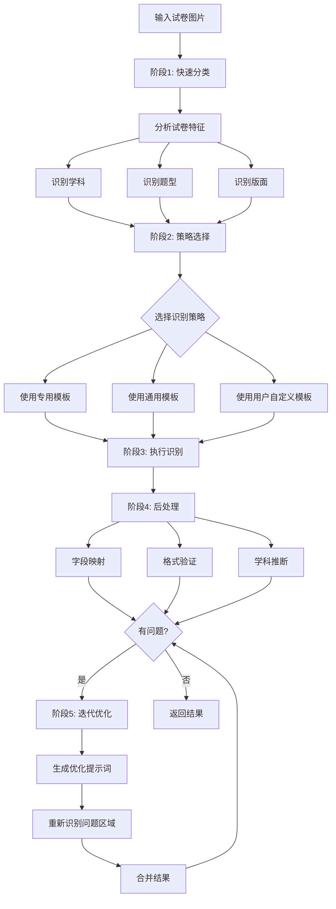

# AI 导师 - 智能试卷识别系统设计文档

> 版本：v1.0
> 更新时间：2025-01-15
> 状态：设计中

---

## 目录

- [1. 系统概述](#1-系统概述)
- [2. 试卷分类体系](#2-试卷分类体系)
- [3. 智能识别系统架构](#3-智能识别系统架构)
- [4. 提示词管理系统](#4-提示词管理系统)
- [5. 基于 Qwen3.5-Plus 的实现方案](#5-基于-qwen35-plus-的实现方案)
- [6. 数据结构设计](#6-数据结构设计)
- [7. API 设计](#7-api-设计)
- [8. 用户界面设计](#8-用户界面设计)
- [9. 实施路线图](#9-实施路线图)

---

## 1. 系统概述

### 1.1 设计目标

构建一个智能化的试卷识别系统，能够：
- 识别多种学科的试卷（数学、语文、英语、物理、化学、生物、历史、地理、政治等）
- 适配多种试卷类型（听写、选择、填空、解答、作文、证明等）
- 处理各种版面设计（标准试卷、练习册、手写答案、答题卡等）
- 支持用户自定义识别规则
- 持续学习和优化

### 1.2 技术选型

- **AI 模型**：Qwen3.5-Plus（通义千问多模态大模型）
- **识别策略**：智能提示词库 + 两阶段识别 + 迭代优化
- **后端框架**：Next.js API Routes
- **前端框架**：React + TypeScript
- **数据存储**：文件系统（JSON）

### 1.3 核心优势

| 特性 | 说明 |
|-----|------|
| **成本可控** | 使用单一模型，无需维护多个模型对接 |
| **实现简单** | 统一的调用接口和输出格式 |
| **智能适配** | 根据试卷特征自动选择最佳识别策略 |
| **用户参与** | 支持用户自定义提示词和模板 |
| **持续优化** | 记录使用情况，不断优化识别效果 |

---

## 2. 试卷分类体系

### 2.1 学科维度分类

```
学科分类树
├── 语文学科
│   ├── 拼音听写
│   ├── 汉字听写
│   ├── 词语默写
│   ├── 古诗词填空
│   ├── 阅读理解（现代文）
│   ├── 阅读理解（文言文）
│   ├── 小作文
│   └── 大作文
├── 英语学科
│   ├── 单词听写
│   ├── 词组翻译
│   ├── 语法选择
│   ├── 完形填空
│   ├── 阅读理解
│   └── 书面表达
├── 数理学科
│   ├── 选择题
│   ├── 填空题
│   ├── 计算题
│   ├── 应用题
│   ├── 证明题
│   └── 几何题
├── 物理学科
│   ├── 概念题
│   ├── 计算题
│   ├── 实验题
│   └── 综合题
├── 化学学科
│   ├── 选择题
│   ├── 填空题
│   ├── 推断题
│   ├── 实验题
│   └── 计算题
├── 生物学科
│   ├── 选择题
│   ├── 填空题
│   ├── 识图题
│   └── 综合题
├── 历史学科
│   ├── 选择题
│   ├── 材料分析题
│   ├── 简答题
│   └── 论述题
├── 地理学科
│   ├── 选择题
│   ├── 填空题
│   ├── 读图题
│   └── 综合题
└── 政治学科
    ├── 选择题
    ├── 简答题
    ├── 材料分析题
    └── 论述题
```

### 2.2 版面特征分类

```
版面类型
├── 标准试卷型
│   ├── 题号连续排列（1、2、3...）
│   ├── 有清晰的分值标注
│   ├── 标准的题目结构（题干+选项）
│   └── 单列或双列布局
├── 听写型
│   ├── 左侧中文/右侧英文
│   ├── 三线格/四线格（语文）
│   ├── 横向排列
│   └── 有示例单词
├── 练习册型
│   ├── 单列/双列布局
│   ├── 有单元标题
│   ├── 有示例题
│   └── 分课时/分章节
├── 手写答案型
│   ├── 学生手写答案
│   ├── 有批改痕迹
│   ├── 答题卡形式
│   └── 混合印刷和手写
├── 作文型
│   ├── 标题/要求区
│   ├── 稿格区（方格/横线）
│   ├── 学生手写内容
│   └── 字数要求标注
└── 综合型
    ├── 多种题型混合
    ├── 多个部分组成
    ├── 图文并茂
    └── 复杂布局
```

### 2.3 题目类型分类

```typescript
enum QuestionType {
  // 选择类
  CHOICE = 'choice',                    // 选择题 (A/B/C/D)
  TRUE_FALSE = 'true_false',          // 判断题

  // 填空类
  FILL = 'fill',                      // 填空题
  MATCH = 'match',                    // 连线题

  // 答题类
  ANSWER = 'answer',                  // 解答题
  CALCULATION = 'calculation',        // 计算题
  PROOF = 'proof',                    // 证明题

  // 特殊类型
  DICTATION = 'dictation',            // 听写/默写
  COMPOSITION = 'essay',              // 作文
  TRANSLATION = 'translation',        // 翻译
  READING_COMPREHENSION = 'reading',  // 阅读理解

  // 其他
  DIAGRAM = 'diagram',                // 识图题
  EXPERIMENT = 'experiment',          // 实验题
  UNKNOWN = 'unknown'                 // 未知类型
}
```

---

## 3. 智能识别系统架构

### 3.1 多阶段识别流程



### 3.2 识别策略矩阵

| 试卷类型 | 识别策略 | 优先使用工具 | 特殊处理 |
|---------|---------|-------------|---------|
| 英语听写 | dictation 模板 | Qwen VL | 中英文分离、词性识别 |
| 数学选择 | choice 模板 | Qwen VL | 选项格式化、答案识别 |
| 数学证明 | proof 模板 | Qwen VL | 公式识别、图形提取 |
| 语文作文 | composition 模板 | Qwen VL | 手写识别、段落分析 |
| 几何题 | geometry 模板 | Qwen VL | 图形元素识别、角度识别 |
| 物理实验 | experiment 模板 | Qwen VL | 仪器识别、数据处理 |
| 通用试卷 | general 模板 | Qwen VL | 启发式识别 |

### 3.3 版面分析引擎

```typescript
interface LayoutAnalysis {
  // 整体布局
  layout: LayoutType

  // 区域划分
  regions: Region[]

  // 特殊元素
  elements: {
    tables: Table[]           // 表格
    diagrams: Diagram[]       // 图形/图表
    formulas: Formula[]       // 数学公式
    handwriting: boolean      // 是否包含手写
    stamps: Stamp[]           // 印章/批改痕迹
  }

  // 纸张特征
  paperFeatures: {
    hasLines: boolean         // 有横线
    hasGrid: boolean          // 有网格
    hasBoxes: boolean        // 有方框
    threeLines: boolean      // 三线格（拼音）
    fourLines: boolean       // 四线格（汉字）
  }

  // 字体特征
  fontFeatures: {
    hasChinese: boolean      // 包含中文
    hasEnglish: boolean      // 包含英文
    hasNumbers: boolean      // 包含数字
    hasSymbols: boolean      // 包含特殊符号
  }
}

enum LayoutType {
  SINGLE_COLUMN = 'single-column',    // 单列布局
  DOUBLE_COLUMN = 'double-column',    // 双列布局
  MIXED = 'mixed',                    // 混合布局
  IRREGULAR = 'irregular',            // 不规则布局
  LEFT_RIGHT = 'left-right',          // 左右对照（听写）
  TOP_BOTTOM = 'top-bottom'            // 上下分区
}
```

---

## 4. 提示词管理系统

### 4.1 系统架构

```
提示词管理系统
├── 提示词库 (Prompt Library)
│   ├── 内置提示词 (Built-in)
│   │   ├── 学科提示词 (Subject Prompts)
│   │   └── 题型模板 (Type Templates)
│   └── 用户提示词 (User Prompts)
│       ├── 用户自定义
│       └── 社区分享
├── 提示词编辑器 (Prompt Editor)
│   ├── 可视化编辑界面
│   ├── 变量支持
│   ├── 示例管理
│   └── 测试功能
├── 提示词选择器 (Prompt Selector)
│   ├── 智能匹配算法
│   ├── 评分机制
│   └── 优先级排序
└── 使用分析器 (Usage Analytics)
    ├── 使用记录
    ├── 成功率统计
    └── A/B 测试
```

### 4.2 数据结构设计

```typescript
interface PromptTemplate {
  // ========== 基础信息 ==========
  id: string                      // 唯一标识 (english_dictation_v1)
  name: string                    // 显示名称 ("英语词汇听写")
  description: string             // 描述 ("用于识别中英文对照的词汇听写试卷")

  // ========== 分类信息 ==========
  category: {
    subject: string               // 学科 (english/math/chinese/...)
    examType: string              // 题型 (dictation/choice/essay/...)
    grade?: string                // 年级 (小学/初中/高中)
    level?: string                // 难度 (基础/中等/提高)
    tags: string[]                // 标签 (["词汇", "听写", "基础"])
  }

  // ========== 提示词内容 ==========
  prompts: {
    system: string                // 系统提示词 (设定AI角色和规则)
    user: string                  // 用户提示词 (具体的识别指令)
    postProcess?: string          // 后处理指令 (如何处理返回结果)
  }

  // ========== 变量定义 ==========
  variables?: {
    name: string                  // 变量名
    description: string           // 描述
    required: boolean             // 是否必需
    defaultValue?: string         // 默认值
  }[]

  // ========== 输出格式 ==========
  outputFormat: {
    type: 'json' | 'markdown' | 'text'
    schema?: object              // JSON Schema (用于验证输出)
    requiredFields: string[]     // 必需字段
    optionalFields: string[]     // 可选字段
  }

  // ========== 后处理规则 ==========
  postProcessing: {
    fieldMapping: {               // 字段映射
      [key: string]: string
    }
    formatRules: string[]         // 格式化规则
    validators: string[]          // 验证规则
  }

  // ========== 元数据 ==========
  metadata: {
    version: string              // 版本号 (v1.0.0)
    author: string               // 作者 (system/user-123/community)
    createdAt: string           // 创建时间
    updatedAt: string           // 更新时间
    usageCount: number           // 使用次数
    successRate: number          // 成功率 (0-1)
    lastUsed?: string            // 最后使用时间
  }

  // ========== 配置 ==========
  config: {
    priority: number             // 优先级 (0-100，越高越优先)
    enabled: boolean             // 是否启用
    isDefault: boolean           // 是否为该分类的默认模板
    allowOverride: boolean       // 允许用户修改
    requireApproval: boolean      // 是否需要审核（社区提示词）
  }

  // ========== 示例 ==========
  examples?: PromptExample[]
}

interface PromptExample {
  name: string                   // 示例名称
  description: string            // 描述
  input: {
    image?: string               // 图片 URL (可选)
    text?: string                // 文本输入 (可选)
    features: ExamFeatures       // 试卷特征
  }
  output: any                     // 预期输出
  notes?: string                 // 说明
}

interface ExamFeatures {
  subject?: string               // 学科
  examType?: string              // 题型
  layout?: LayoutType            // 布局类型
  hasDiagrams: boolean           // 是否包含图形
  hasFormulas: boolean           // 是否包含公式
  hasHandwriting: boolean        // 是否包含手写
  language: 'chinese' | 'english' | 'mixed'  // 语言
}
```

### 4.3 提示词文件组织

```
data/prompts/
├── built-in/                    # 内置提示词
│   ├── subjects/                # 学科提示词
│   │   ├── english.json         # 英语学科
│   │   ├── math.json            # 数学学科
│   │   ├── chinese.json         # 语文学科
│   │   ├── physics.json         # 物理学科
│   │   ├── chemistry.json       # 化学学科
│   │   ├── biology.json         # 生物学科
│   │   ├── history.json         # 历史学科
│   │   ├── geography.json       # 地理学科
│   │   └── politics.json        # 政治学科
│   ├── types/                   # 题型模板
│   │   ├── dictation.json       # 听写类
│   │   ├── multiple-choice.json # 选择题
│   │   ├── fill-blank.json      # 填空题
│   │   ├── composition.json     # 作文类
│   │   ├── proof.json           # 证明题
│   │   ├── reading.json         # 阅读理解
│   │   └── general.json         # 通用模板
│   └── README.md                # 提示词库说明文档
├── user-custom/                 # 用户自定义提示词
│   ├── {userId}/                # 按用户ID组织
│   │   └── {promptId}.json
│   └── shared/                  # 用户分享的提示词
│       └── community/           # 社区提示词
│           └── {promptId}.json
└── .gitkeep
```

### 4.4 提示词选择算法

```typescript
class PromptSelector {
  /**
   * 根据试卷特征选择最佳提示词
   */
  selectBestPrompt(
    features: ExamFeatures,
    userPrompts?: PromptTemplate[],
    userPreferences?: UserPreferences
  ): PromptTemplate {
    // 1. 获取候选提示词（用户提示词 + 内置提示词）
    const candidates = [
      ...(userPrompts || []),
      ...this.getBuiltInPrompts()
    ].filter(p => p.config.enabled)

    // 2. 计算匹配分数
    const scored = candidates.map(prompt => ({
      prompt,
      score: this.calculateMatchScore(prompt, features)
    }))

    // 3. 按分数排序
    scored.sort((a, b) => b.score - a.score)

    // 4. 考虑用户偏好
    if (userPreferences?.preferredPrompts?.length > 0) {
      const preferred = scored.filter(s =>
        userPreferences.preferredPrompts.includes(s.prompt.id)
      )
      if (preferred.length > 0 && preferred[0].score > 50) {
        return preferred[0].prompt
      }
    }

    // 5. 返回最高分的提示词
    return scored[0]?.prompt || this.getDefaultPrompt()
  }

  /**
   * 计算匹配分数
   */
  private calculateMatchScore(
    prompt: PromptTemplate,
    features: ExamFeatures
  ): number {
    let score = 0

    // 学科匹配 (40分)
    if (features.subject && prompt.category.subject === features.subject) {
      score += 40
    } else if (!features.subject) {
      // 如果未指定学科，使用默认值
      score += 10
    }

    // 题型匹配 (30分)
    if (features.examType && prompt.category.examType === features.examType) {
      score += 30
    }

    // 标签匹配 (20分)
    const tagMatches = prompt.category.tags.filter(tag =>
      this.featuresMatchTag(features, tag)
    ).length
    score += Math.min(tagMatches * 5, 20)

    // 历史成功率 (10分)
    score += prompt.metadata.successRate * 10

    // 优先级 (不加分，用于排序)
    // score += prompt.config.priority * 0.1

    return score
  }

  /**
   * 特征是否匹配标签
   */
  private featuresMatchTag(features: ExamFeatures, tag: string): boolean {
    const tagMap: Record<string, (f: ExamFeatures) => boolean> = {
      '词汇': f => f.language === 'english' || f.language === 'mixed',
      '听写': f => f.layout === 'left-right',
      '图形': f => f.hasDiagrams,
      '公式': f => f.hasFormulas,
      '手写': f => f.hasHandwriting
    }

    const checker = tagMap[tag]
    return checker ? checker(features) : false
  }
}
```

---

## 5. 基于 Qwen3.5-Plus 的实现方案

### 5.1 方案概述

使用单一的多模态大模型 Qwen3.5-Plus，通过智能提示词工程实现多种试卷类型的识别。

**优势：**
- ✅ 成本可控：只需一个 API 调用
- ✅ 实现简单：统一的接口和输出格式
- ✅ 中文友好：Qwen 对中文试卷识别优秀
- ✅ 视觉能力强：支持图片理解和 OCR
- ✅ 结构化输出：支持 JSON 格式输出

**核心策略：**
1. **智能提示词库**：针对不同学科/题型使用专门的提示词
2. **两阶段识别**：先快速分类，再详细识别
3. **迭代优化**：自动检测问题并优化识别结果
4. **后处理增强**：字段映射、格式验证、学科推断

### 5.2 识别流程

```typescript
// lib/recognizers/qwen-recognizer.ts

export class QwenExamRecognizer {
  private model: QwenClient
  private promptManager: PromptManager

  constructor() {
    this.model = new QwenClient({
      apiKey: process.env.DASHSCOPE_API_KEY!,
      model: 'qwen-vl-plus'
    })
    this.promptManager = new PromptManager()
  }

  /**
   * 识别试卷
   */
  async recognize(
    image: string,  // base64 图片
    context: RecognitionContext
  ): Promise<RecognitionResult> {
    console.log(`[QwenRecognizer] 开始识别试卷`)

    // 阶段1：快速分类
    const classification = await this.classify(image)
    console.log(`[QwenRecognizer] 分类结果:`, classification)

    // 阶段2：选择提示词模板
    const template = this.promptManager.selectBestPrompt({
      subject: classification.subject,
      examType: classification.examType,
      layout: classification.layout,
      ...classification.features
    })

    console.log(`[QwenRecognizer] 使用模板: ${template.name} (${template.id})`)

    // 阶段3：构建提示词
    const prompt = this.buildPrompt(template, context)

    // 阶段4：调用模型
    const response = await this.callModel(prompt, image)

    // 阶段5：后处理
    let result = this.postProcess(response, template)

    // 阶段6：迭代优化（如果需要）
    result = await this.iterativelyOptimize(image, result, template, context)

    // 阶段7：记录使用情况
    await this.recordUsage(template.id, result)

    return result
  }

  /**
   * 快速分类
   */
  private async classify(image: string): Promise<ClassificationResult> {
    const prompt = `请快速分析这张试卷图片，返回 JSON 格式：
{
  "subject": "学科名称 (数学/语文/英语/物理/化学/生物/历史/地理/政治)",
  "examType": "试卷类型 (听写/选择/填空/解答/作文/证明)",
  "layout": "布局类型 (单列/双列/左右对照/上下分区/混合)",
  "hasDiagrams": false,
  "hasFormulas": false,
  "hasHandwriting": false,
  "language": "语言 (中文/英文/混合)",
  "confidence": 0.9
}

注意：
- 如果看到中英文对照，language 设为 "混合"
- 如果有中文词汇+英文单词，examType 设为 "听写"
- 如果看到证明题或图形，hasDiagrams 设为 true
- 如果看到数学公式，hasFormulas 设为 true`
- 如果看到手写内容，hasHandwriting 设为 true`

只返回 JSON，不要有其他内容。`

    const response = await this.model.call(prompt, image)
    return JSON.parse(response)
  }

  /**
   * 构建提示词
   */
  private buildPrompt(
    template: PromptTemplate,
    context: RecognitionContext
  ): string {
    let prompt = template.prompts.system + "\n\n"

    // 添加用户自定义提示词
    if (context.customPrompt) {
      prompt += `【用户特殊要求】\n${context.customPrompt}\n\n`
    }

    // 添加用户提示词
    prompt += template.prompts.user

    // 替换变量
    const variables = {
      '{subject}': context.subject || '待识别',
      '{examType}': context.examType || '待识别',
      '{grade}': context.grade || '',
      '{customHint}': context.customPrompt || '',
      '{date}': new Date().toLocaleDateString('zh-CN')
    }

    for (const [key, value] of Object.entries(variables)) {
      prompt = prompt.replace(new RegExp(key, 'g'), value)
    }

    return prompt
  }

  /**
   * 迭代优化
   */
  private async iterativelyOptimize(
    image: string,
    result: RecognitionResult,
    template: PromptTemplate,
    context: RecognitionContext,
    maxIterations: number = 2
  ): Promise<RecognitionResult> {
    for (let i = 0; i < maxIterations; i++) {
      // 检测问题
      const issues = this.detectIssues(result)

      if (issues.length === 0) {
        console.log(`[QwenRecognizer] 第${i + 1}次迭代：无问题，结束优化`)
        break
      }

      console.log(`[QwenRecognizer] 第${i + 1}次迭代：发现 ${issues.length} 个问题`)

      // 生成优化提示词
      const optimizationPrompt = this.generateOptimizationPrompt(result, issues, template)

      // 重新识别
      const optimized = await this.callModel(optimizationPrompt, image)
      const optimizedResult = JSON.parse(optimized)

      // 合并结果
      result = this.mergeResults(result, optimizedResult, issues)
    }

    return result
  }

  /**
   * 检测识别问题
   */
  private detectIssues(result: RecognitionResult): Issue[] {
    const issues: Issue[] = []

    // 检查题目完整性
    result.questions.forEach((q, i) => {
      if (!q.content || q.content.trim() === '') {
        issues.push({
          type: 'missing_content',
          questionIndex: i,
          severity: 'high'
        })
      }
      if (!q.type || q.type === 'unknown') {
        issues.push({
          type: 'unknown_type',
          questionIndex: i,
          severity: 'medium'
        })
      }
      if (!q.number && q.number !== '0') {
        issues.push({
          type: 'missing_number',
          questionIndex: i,
          severity: 'high'
        })
      }
    })

    // 检查学科是否合理
    if (!result.detectedSubject) {
      issues.push({
        type: 'missing_subject',
        severity: 'high'
      })
    } else if (result.detectedSubject === '数学' && this.hasEnglishKeywords(result)) {
      issues.push({
        type: 'subject_mismatch',
        severity: 'high',
        detectedSubject: result.detectedSubject
      })
    }

    return issues
  }
}
```

### 5.3 Qwen 客户端

```typescript
// lib/ai/qwen-client.ts

export class QwenClient {
  private apiKey: string
  private model: string
  private baseUrl: string

  constructor(config: QwenConfig) {
    this.apiKey = config.apiKey
    this.model = config.model
    this.baseUrl = config.endpoint || 'https://dashscope.aliyuncs.com/compatible-mode/v1'
  }

  /**
   * 调用 Qwen 模型
   */
  async call(prompt: string, image?: string): Promise<QwenResponse> {
    const messages: Message[] = [
      {
        role: 'system',
        content: '你是专业的试卷识别系统。'
      },
      {
        role: 'user',
        content: prompt,
        ...(image && { images: [image] })
      }
    ]

    const response = await fetch(`${this.baseUrl}/chat/completions`, {
      method: 'POST',
      headers: {
        'Authorization': `Bearer ${this.apiKey}`,
        'Content-Type': 'application/json'
      },
      body: JSON.stringify({
        model: this.model,
        messages,
        temperature: 0.1,
        max_tokens: 8000,
        result_format: 'message'  // 确保 JSON 输出
      })
    })

    if (!response.ok) {
      throw new Error(`Qwen API error: ${response.status}`)
    }

    const data = await response.json()
    return data.choices[0].message
  }
}

interface QwenConfig {
  apiKey: string
  model?: string
  endpoint?: string
}

interface Message {
  role: 'system' | 'user'
  content: string
  images?: string[]
}

interface QwenResponse {
  content: string
}
```

---

## 6. 数据结构设计

### 6.1 核心数据结构

```typescript
// ========== 试卷识别结果 ==========
interface RecognitionResult {
  // 基础信息
  id: string                      // 试卷 ID
  recognizedAt: string           // 识别时间
  recognizerVersion: string     // 识别器版本

  // 识别结果
  subject: string                // 学科
  subjectName?: string           // 学科中文名称
  examType: string               // 试卷类型
  layout: LayoutType            // 布局类型

  // 题目数据
  questions: Question[]

  // 原始文本
  rawText?: string

  // 元数据
  metadata: ExamMetadata
}

// ========== 题目数据 ==========
interface Question {
  number: string                // 题号 (字符串格式)
  type: QuestionType           // 题型
  content: string              // 题目内容/要求
  options?: string[]            // 选项 (A/B/C/D)
  userAnswer?: string          // 用户答案
  correctAnswer?: string       // 正确答案
  score?: number               // 分值
  difficulty?: number          // 难度 (1-5)
  knowledgePoints?: string[]   // 知识点

  // 位置信息
  bbox?: BoundingBox

  // 扩展字段
  [key: string]: any            // 其他字段
}

// ========== 元数据 ==========
interface ExamMetadata {
  // AI 识别信息
  detectedSubject?: string     // AI 识别的学科
  overallDifficulty?: number   // 整体难度
  estimatedTime?: number       // 预估完成时间

  // 识别配置
  recognitionStrategy: {
    templateId?: string         // 使用的模板 ID
    userPrompt?: string         // 用户自定义提示词
    optimizationRounds?: number  // 优化轮数
  }

  // 识别质量
  confidence: {
    overall: number            // 整体置信度
    subject: number            // 学科识别置信度
    questions: number[]        // 每题置信度
  }

  // 统计信息
  stats: {
    totalQuestions: number
    byType: Record<QuestionType, number>
    byDifficulty: Record<number, number>
  }

  // 特殊特征
  features: {
    isEssay: boolean
    essayType?: string
    hasDiagrams: boolean
    hasFormulas: boolean
    hasHandwriting: boolean
  }

  // 自定义提示词
  customPrompt?: string        // 用户提供的自定义提示词
}

// ========== 边界框 ==========
interface BoundingBox {
  x: number                    // 左上角 X 百分比 (0-100)
  y: number                    // 左上角 Y 百分比 (0-100)
  width: number                // 宽度百分比 (0-100)
  height: number               // 高度百分比 (0-100)
}

// ========== 用户上下文 ==========
interface UserContext {
  // 学科配置
  enabledSubjects: Subject[]

  // 用户偏好
  preferences: {
    autoClassify: boolean
    preserveFormatting: boolean
    extractDiagrams: boolean
  }

  // 自定义模板
  customTemplates?: PromptTemplate[]

  // 历史记录
  history?: RecognitionHistory[]
}

// ========== 识别上下文 ==========
interface RecognitionContext {
  customPrompt?: string         // 用户自定义提示词
  subject?: string              // 用户指定学科
  examType?: string             // 用户指定试卷类型
  grade?: string                // 年级
}

// ========== 问题定义 ==========
interface Issue {
  type: string                  // 问题类型
  severity: 'low' | 'medium' | 'high'  // 严重程度
  questionIndex?: number       // 题目索引
  detectedSubject?: string      // 检测到的学科
  message?: string             // 问题描述
}

// ========== 分类结果 ==========
interface ClassificationResult {
  subject: string               // 学科
  examType: string              // 试卷类型
  layout: LayoutType            // 布局
  features: {
    hasDiagrams: boolean
    hasFormulas: boolean
    hasHandwriting: boolean
  }
  language: string
  confidence: number           // 置信度
}
```

### 6.2 存储结构

```
data/
├── exams/                       # 试卷数据
│   ├── {subject}/               # 按学科分类
│   │   └── {date}/              # 按日期分类
│   │       └── {examId}/
│   │           ├── data.json    # 试卷数据
│   │           └── image.png    # 试卷图片
├── prompts/                     # 提示词库
│   ├── built-in/
│   │   ├── subjects/
│   │   └── types/
│   └── user-custom/
├── reports/                     # 学习报告
│   └── {subject}/
│       └── {timestamp}/
│           ├── meta.json
│           └── report.md
├── subjects.json               # 学科配置
└── recognition-history/         # 识别历史（可选）
    └── {date}/
        └── {examId}.json
```

---

## 7. API 设计

### 7.1 试卷识别 API

```
POST /api/exam/parse-image
```

**请求：**
- `file`: File (FormData) - 试卷图片
- `customPrompt`: string (可选) - 用户自定义提示词

**响应：**
```json
{
  "success": true,
  "examId": "exam-123",
  "result": {
    "subject": "english",
    "examType": "词汇听写",
    "questions": [...]
  },
  "metadata": {
    "confidence": 0.95,
    "template": {
      "id": "english_dictation_v1",
      "name": "英语词汇听写"
    }
  }
}
```

### 7.2 提示词管理 API

```
GET    /api/prompts                    # 获取提示词列表
GET    /api/prompts/:id                # 获取单个提示词
POST   /api/prompts                    # 创建提示词
PUT    /api/prompts/:id                # 更新提示词
DELETE /api/prompts/:id                # 删除提示词
POST   /api/prompts/:id/test           # 测试提示词
GET    /api/prompts/default/:subject    # 获取学科默认提示词
GET    /api/prompts/user                # 获取用户自定义提示词
```

**示例：获取提示词列表**
```
GET /api/prompts?subject=english&examType=dictation

响应：
{
  "prompts": [
    {
      "id": "english_dictation_v1",
      "name": "英语词汇听写",
      "category": {
        "subject": "english",
        "examType": "dictation",
        "tags": ["词汇", "听写"]
      },
      "metadata": {
        "usageCount": 128,
        "successRate": 0.95
      },
      "config": {
        "priority": 10,
        "isDefault": true
      }
    }
  ]
}
```

**示例：创建提示词**
```
POST /api/prompts

请求体：
{
  "name": "我的自定义英语听写模板",
  "category": {
    "subject": "english",
    "examType": "dictation",
    "tags": ["词汇", "八年级"]
  },
  "prompts": {
    "system": "你是专业的英语试卷识别专家...",
    "user": "请识别这张英语试卷..."
  },
  "config": {
    "priority": 50,
    "enabled": true
  }
}
```

### 7.3 使用统计 API

```
GET /api/prompts/:id/stats         # 获取提示词使用统计
POST /api/prompts/:id/record       # 记录使用情况
```

---

## 8. 用户界面设计

### 8.1 添加试卷对话框（已优化）

```
┌─────────────────────────────────────────┐
│            添加新试卷                     │
├─────────────────────────────────────────┤
│                                         │
│  🤖 AI 识别提示词（可选）                │
│  ┌─────────────────────────────────┐   │
│  │ 可选：输入针对当前试卷的个性化    │   │
│  │ 识别要求，例如：                 │   │
│  │ - 这是八年级数学几何单元测试     │   │
│  │ - 重点识别图形中的角度关系       │   │
│  │ - 选项是 A. B. C. D. 格式        │   │
│  └─────────────────────────────────┘   │
│  💡 如果试卷格式特殊或需要重点识别    │
│     某些内容，可以在这里说明。         │
│                                         │
│  ───────────────────────────────────  │
│                                         │
│  📷 图片上传                            │
│  ┌─────────────────────────────────┐   │
│  │                                 │   │
│  │       拖放图片到此处               │   │
│  │                                 │   │
│  └─────────────────────────────────┘   │
│                                         │
│              [取消]  [开始解析]          │
└─────────────────────────────────────────┘
```

### 8.2 提示词管理页面

```
┌─────────────────────────────────────────────────────────┐
│  提示词管理                                            │
├─────────────────────────────────────────────────────────┤
│                                                         │
│  [+ 新建提示词]  [导入]  [导出]                            │
│                                                         │
│  筛选: [全部▼] [英语] [数学] [语文] [我的]               │
│                                                         │
│  ┌─────────────────────────────────────────────────┐   │
│  │  📝 英语词汇听写 v1                    ⭐ 默认   │   │
│  │  ├─ 学科: 英语  ├─ 类型: 听写  ├─ 使用: 128次│   │
│  │  ├─ 标签: #词汇 #听写 #基础                      │   │
│  │  ├─ 成功率: 95%                                  │   │
│  │  └─ 最后更新: 3天前                              │   │
│  │                                                  │   │
│  │  [编辑]  [复制]  [测试]  [删除]                   │   │
│  ├─────────────────────────────────────────────────┤   │
│  │  📐 几何证明题 v1                               │   │
│  │  ├─ 学科: 数学  ├─ 类型: 证明题  ├─ 使用: 45次 │   │
│  │  └─ 标签: #图形 #证明 #综合                      │   │
│  │                                                  │   │
│  │  [编辑]  [测试]  [删除]                            │   │
│  ├─────────────────────────────────────────────────┤   │
│  │  ✏️ 我的自定义模板                              │   │
│  │  └─ 针对八年级数学练习册优化                    │   │
│  │                                                  │   │
│  │  [编辑]  [分享]  [删除]                            │   │
│  └─────────────────────────────────────────────────┘   │
└─────────────────────────────────────────────────────────┘
```

### 8.3 提示词编辑器

```
┌─────────────────────────────────────────────────────────┐
│  编辑提示词                                            │
├─────────────────────────────────────────────────────────┤
│                                                         │
│  基本信息                                              │
│  ┌─────────────────────────────────────────────────┐   │
│  │  名称: [英语词汇听写               ]           │   │
│  │  描述: [用于识别中英文对照的词汇听写试卷   ]   │   │
│  │                                                 │   │
│  │  学科: [英语 ▼]  题型: [听写 ▼]              │   │
│  │  年级: [初中 ▼]   标签: [词汇, 听写, 基础] │   │
│  └─────────────────────────────────────────────────┘   │
│                                                         │
│  系统提示词                                              │
│  ┌─────────────────────────────────────────────────┐   │
│  │ 你是专业的英语试卷识别专家，擅长识别      │   │
│  │ 中英文对照的词汇听写试卷。                  │   │
│  │                                                 │   │
│  │ 你的任务是：                                │   │
│  │ 1. 准确识别左侧的中文词汇                    │   │
│  │  2. 准确识别右侧的学生英文答案                │   │
│  │  3. 保留原始格式，包括词性标记              │   │
│  └─────────────────────────────────────────────────┘   │
│                                                         │
│  用户提示词                                              │
│  ┌─────────────────────────────────────────────────┐   │
│  │ 请仔细识别这张英语词汇听写试卷，特别注意：  │   │
│  │                                                 │   │
│  │ 1. **学科识别**：这是英语词汇试卷，      │   │
│  │    detectedSubject 必须是 "英语"             │   │
│  │                                                 │   │
│  │ 2. **识别要求**：                           │   │
│  │    - 识别左侧的中文词汇（如"狐狸"）        │   │
│  │    - 识别右侧的学生英文答案（如"fox n."）   │   │
│  │    - 保留原始格式，包括词性标记          │   │
│  │                                                 │   │
│  │ 返回JSON格式：{...}                          │   │
│  └─────────────────────────────────────────────────┘   │
│                                                         │
│  支持的变量                                              │
│  ┌─────────────────────────────────────────────────┐   │
│  │ {subject} - 学科名称                            │   │
│  │ {examType} - 试卷类型                           │   │
│  │ {customHint} - 用户自定义提示                   │   │
│  └─────────────────────────────────────────────────┘   │
│                                                         │
│  示例（可选）                                            │
│  [+ 添加示例]                                          │
│                                                         │
│  使用统计                                                │
│  ├─ 使用次数: 128                                    │
│  ├─ 成功率: 95%                                      │
│  ├─ 最后使用: 2小时前                                │
│  └─ 平均响应时间: 3.2s                               │
│                                                         │
│  高级设置                                                │
│  ├─ 优先级: [10]                 [设为默认]      │   │
│  ├─ 允许覆盖用户修改: [✓]                          │   │
│  └─ 状态: [已启用]                                   │
│                                                         │
│         [测试提示词]  [保存]  [取消]                    │
└─────────────────────────────────────────────────────────┘
```

### 8.4 提示词测试器

```
┌─────────────────────────────────────────────────────────┐
│  测试提示词                                            │
├─────────────────────────────────────────────────────────┤
│                                                         │
│  上传测试图片                                            │
│  ┌─────────────────────────────────────────────────┐   │
│  │                                                 │   │
│  │       拖放图片到此处测试                       │   │
│  │                                                 │   │
│  └─────────────────────────────────────────────────┘   │
│                                                         │
│  或者输入测试文本                                        │
│  ┌─────────────────────────────────────────────────┐   │
│  │ 狐狸   fox n.                                  │   │
│  │ 长颈鹿 giraffe n.                              │   │
│  │ 雕颈鹿 giraffe n.                              │   │
│  └─────────────────────────────────────────────────┘   │
│                                                         │
│  [开始测试]                                              │
│                                                         │
│  测试结果                                                │
│  ┌─────────────────────────────────────────────────┐   │
│  │ ✅ 识别成功                                    │   │
│  │ ├─ 识别学科: 英语                               │   │
│  │ ├─ 识别题型: 听写                               │   │
│  │ ├─ 识别题目数: 10                               │   │
│  │ ├─ 置信度: 0.98                                 │   │
│  │ └─ 响应时间: 2.1s                               │   │
│  │                                                 │   │
│  │ 输出结果:                                       │   │
│  │ ┌─────────────────────────────────────────┐   │
│  │ │ {                                       │   │
│  │ │   "questions": [                         │   │
│  │ │     {"number": "1", ...}                 │   │
│  │ │   ]                                     │   │
│  │ │ }                                       │   │
│  │ └─────────────────────────────────────────┘   │
│  └─────────────────────────────────────────────────┘   │
│                                                         │
│              [保存到我的模板]  [重新测试]           │
└─────────────────────────────────────────────────────────┘
```

---

## 9. 实施路线图

### 9.1 阶段1：基础增强（1-2天）

**目标**：建立提示词管理系统基础

**任务**：
1. ✅ 创建提示词数据结构和类型定义
2. ✅ 实现提示词文件系统存储
3. ✅ 创建提示词管理 API
4. ✅ 更新识别器使用提示词库
5. ✅ 添加学科推断功能

**交付物**：
- `types/prompt.ts` - 提示词类型定义
- `lib/prompts/prompt-manager.ts` - 提示词管理器
- `app/api/prompts/route.ts` - 提示词 API
- `data/prompts/built-in/` - 内置提示词库

### 9.2 阶段2：UI 界面（2-3天）

**目标**：提供用户友好的提示词管理界面

**任务**：
1. 创建提示词管理页面
2. 实现提示词编辑器
3. 实现提示词测试功能
4. 添加提示词卡片展示

**交付物**：
- `app/(dashboard)/prompts/page.tsx` - 提示词管理页面
- `components/PromptEditor.tsx` - 提示词编辑器
- `components/PromptTester.tsx` - 提示词测试器
- `components/PromptCard.tsx` - 提示词卡片

### 9.3 阶段3：识别增强（2天）

**目标**：实现两阶段识别和迭代优化

**任务**：
1. 实现快速分类功能
2. 实现两阶段识别流程
3. 添加问题检测机制
4. 实现迭代优化功能

**交付物**：
- `lib/recognizers/two-stage-recognizer.ts`
- `lib/recognizers/iterative-recognizer.ts`
- 更新 `QwenExamRecognizer` 使用新架构

### 9.4 阶段4：优化与测试（1-2天）

**目标**：完善细节，测试各种场景

**任务**：
1. 扩展内置提示词库
2. 添加更多后处理规则
3. 测试各种试卷类型
4. 性能优化

**交付物**：
- 完整的内置提示词库（英语/数学/语文/物理/化学/生物/历史/地理/政治）
- 测试报告
- 使用文档

### 9.5 阶段5：高级功能（可选）

**目标**：添加高级特性

**任务**：
1. 提示词版本控制
2. A/B 测试功能
3. 提示词分享社区
4. 使用统计和分析

**交付物**：
- 提示词版本管理系统
- A/B 测试框架
- 社区分享功能
- 使用分析仪表板

---

## 10. 配置示例

### 10.1 环境变量配置

```bash
# .env

# Qwen API 配置
DASHSCOPE_API_KEY=your_api_key_here

# 可选：模型配置
QWEN_MODEL=qwen-vl-plus
QWEN_ENDPOINT=https://dashscope.aliyuncs.com/compatible-mode/v1

# 可选：识别配置
RECOGNITION_MAX_ITERATIONS=2
RECOGNITION_CONFIDENCE_THRESHOLD=0.8
```

### 10.2 应用配置

```typescript
// config/recognition.ts

export const RECOGNITION_CONFIG = {
  model: {
    provider: 'dashscope',
    model: 'qwen-vl-plus',
    maxTokens: 8000,
    temperature: 0.1
  },

  features: {
    twoStageRecognition: true,    // 两阶段识别
    iterativeOptimization: true,   // 迭代优化
    maxIterations: 2,
    confidenceThreshold: 0.8,
    autoSelectTemplate: true      // 自动选择模板
  },

  prompts: {
    libraryPath: './data/prompts',
    enableUserPrompts: true,
    allowCustomOverride: true,
    trackUsage: true              // 跟踪使用情况
  }
}
```

---

## 11. 内置提示词示例

### 11.1 英语听写提示词

```json
{
  "id": "english_dictation_v1",
  "name": "英语词汇听写",
  "description": "识别中英文对照的词汇听写试卷",
  "category": {
    "subject": "english",
    "examType": "dictation",
    "tags": ["词汇", "听写", "基础"]
  },
  "prompts": {
    "system": "你是专业的英语试卷识别专家，擅长识别中英文对照的词汇听写试卷。",
    "user": "请仔细识别这张英语词汇听写试卷。\n\n**重要要求**：\n1. **学科识别**：这是英语词汇试卷，detectedSubject 必须设为 \"英语\"\n\n2. **识别内容**：\n   - 识别左侧/上方的中文词汇（如\"狐狸\"、\"长颈鹿\"）\n   - 识别右侧/下方学生的英文答案（如\"fox n.\"、\"giraffe n.\"）\n   - 保留原始格式，包括词性标记（n./v./adj./prep.等）\n\n3. **格式要求**：\n   - 题号必须使用字符串格式（\"1\" 而不是 1）\n   - type 字段设为 \"dictation\"\n   - content 字段填写中文词汇\n   - userAnswer 字段填写学生的英文答案\n   - score 默认为 1 分\n\n返回JSON格式：\n{\n  \"title\": \"试卷标题\",\n  \"detectedSubject\": \"英语\",\n  \"examType\": \"词汇听写\",\n  \"questions\": [\n    {\n      \"number\": \"1\",\n      \"type\": \"dictation\",\n      \"content\": \"狐狸\",\n      \"userAnswer\": \"fox n.\",\n      \"score\": 1\n    }\n  ]\n}"
  },
  "outputFormat": {
    "type": "json",
    "requiredFields": ["detectedSubject", "questions"]
  },
  "config": {
    "priority": 10,
    "enabled": true,
    "isDefault": true
  }
}
```

### 11.2 数学证明题提示词

```json
{
  "id": "math_proof_v1",
  "name": "数学证明题",
  "description": "识别包含几何图形和证明步骤的数学试卷",
  "category": {
    "subject": "math",
    "examType": "proof",
    "tags": ["几何", "证明", "图形", "综合"]
  },
  "prompts": {
    "system": "你是专业的数学试卷识别专家，擅长识别几何图形、数学公式和证明题。",
    "user": "请识别这张数学试卷，特别注意：\n\n**学科识别**：根据试卷内容识别具体学科（几何/代数/综合）\n\n**识别重点**：\n1. 几何图形识别：\n   - 识别图形中的角度标注（如∠ABC、∠BAC）\n   - 识别边长标注（如 AB=5cm）\n   - 识别辅助线（虚线表示）\n\n2. 证明步骤识别：\n   - 识别证明步骤编号（①②③ 或 (1)(2)(3)）\n   - 识别\"证明\"、\"∵\"、\"=\"等关键符号\n   - 保留完整的证明过程\n\n3. 数学公式识别：\n   - 识别数学符号（∵、∑、∫、√等）\n   - 识别字母上下标（a²、sin²α等）\n\n4. 题号处理：\n   - 使用字符串格式（\"1\" 而不是 1）\n   - 相同题号在不同小问中是正常的\n\n返回JSON格式：\n{\n  \"title\": \"试卷标题\",\n  \"detectedSubject\": \"数学/几何\",\n  \"examType\": \"证明题\",\n  \"questions\": [...]\n}"
  },
  "outputFormat": {
    "type": "json",
    "requiredFields": ["detectedSubject", "questions"]
  },
  "config": {
    "priority": 9,
    "enabled": true,
    "isDefault": true
  }
}
```

### 11.3 语文作文提示词

```json
{
  "id": "chinese_composition_v1",
  "name": "语文作文",
  "description": "识别语文作文试卷，包括题目要求和学生手写作文",
  "category": {
    "subject": "chinese",
    "examType": "composition",
    "tags": ["作文", "写作", "表达"]
  },
  "prompts": {
    "system": "你是专业的语文试卷识别专家，擅长识别作文试卷和分析学生写作水平。",
    "user": "请识别这张语文作文试卷，特别注意：\n\n**学科识别**：这是语文作文试卷，detectedSubject 必须设为 \"语文\"\n\n**识别内容**：\n1. 题目识别：\n   - 识别作文题目或提示语\n   - 识别字数要求\n   - 识别体裁要求（记叙文/议论文/说明文/应用文）\n\n2. 学生作文识别：\n   - 完整识别学生手写的作文内容\n   - 保留段落结构和格式\n   - 识别标点符号\n   - 尽可能保持原文\n\n3. 评估信息：\n   - 估算字数\n   - 判断作文体裁\n\n返回JSON格式：\n{\n  \"title\": \"试卷标题\",\n  \"detectedSubject\": \"语文\",\n  \"examType\": \"作文\",\n  \"isEssay\": true,\n  \"essayType\": \"语文作文\",\n  \"questions\": [\n    {\n      \"number\": \"1\",\n      \"type\": \"essay\",\n      \"content\": \"作文题目要求和评分标准\",\n      \"userAnswer\": \"学生手写作文的完整内容，保留段落结构\",\n      \"wordCount\": 预估字数,\n      \"essayGenre\": \"记叙文\",\n      \"score\": 30\n    }\n  ]\n}"
  },
  "outputFormat": {
    "type": "json",
    "requiredFields": ["detectedSubject", "questions"]
  },
  "config": {
    "priority": 10,
    "enabled": true,
    "isDefault": true
  }
}
```

---

## 12. 使用示例

### 12.1 基本使用流程

```
1. 用户打开"添加试卷"对话框
   ↓
2. （可选）输入自定义识别提示词
   ↓
3. 上传试卷图片
   ↓
4. 系统自动：
   - 快速分析试卷特征
   - 选择最佳提示词模板
   - 构建完整提示词
   - 调用 Qwen 模型识别
   - 后处理和优化结果
   ↓
5. 显示识别结果供用户确认
   ↓
6. 保存到数据文件
```

### 12.2 自定义提示词使用场景

```
场景：八年级数学练习册，题目格式特殊

用户操作：
1. 在"添加试卷"对话框中输入提示词：
   "这是八年级数学练习册，题目按课时编排，
    注意识别课时标题（如'第3课时 三角形全等'），
    题目编号格式是'课时-题号'（如'3-1'表示第3课时第1题）"

2. 上传图片

系统处理：
- 检测到用户自定义提示词
- 将自定义提示词与基础模板合并
- 使用增强的提示词进行识别
- 识别结果中记录使用了自定义提示词

效果：
- 正确识别课时标题
- 按课时组织题目
- 题号格式符合用户要求
```

---

## 13. 最佳实践

### 13.1 提示词编写原则

1. **明确性**：清晰说明识别目标和要求
2. **结构化**：使用分层结构，先总体后具体
3. **示例化**：提供输入输出示例
4. **容错性**：考虑边缘情况和异常格式
5. **可维护**：使用变量和模板，便于复用

### 13.2 提示词优化建议

1. **针对性强**：不同学科/题型使用专门提示词
2. **多轮迭代**：根据识别效果持续优化
3. **用户参与**：允许用户自定义和分享
4. **数据驱动**：基于使用统计优化提示词

### 13.3 性能优化

1. **缓存常用**：缓存频繁使用的提示词
2. **批量处理**：支持批量识别时复用分类结果
3. **并行处理**：独立图片可并行识别
4. **增量更新**：只优化有问题的部分

---

## 14. 故障排查

### 14.1 常见问题

| 问题 | 可能原因 | 解决方案 |
|-----|---------|---------|
| 学科识别错误 | 提示词未强调学科 | 添加学科识别要求 |
| 题目格式错误 | 字段映射缺失 | 更新后处理规则 |
| 特殊格式无法识别 | 缺少专用模板 | 创建用户自定义模板 |
| 识别速度慢 | 模型调用次数多 | 启用两阶段识别 |
| 成功率低 | 提示词不够精确 | 优化提示词并迭代 |

### 14.2 调试技巧

1. **启用详细日志**：记录识别过程
2. **测试单一变量**：每次只改一个地方
3.收集样本数据**：保存失败的样本用于分析
4. **A/B 测试**：对比不同提示词的效果

---

## 15. 附录

### 15.1 完整的类型定义

```typescript
// types/index.ts

export * from './prompt'
export * from './exam'
export * from './recognition'
```

### 15.2 API 端点汇总

| 端点 | 方法 | 说明 |
|-----|------|------|
| `/api/exam/parse-image` | POST | 图片识别试卷 |
| `/api/prompts` | GET | 获取提示词列表 |
| `/api/prompts` | POST | 创建提示词 |
| `/api/prompts/:id` | GET | 获取单个提示词 |
| `/api/prompts/:id` | PUT | 更新提示词 |
| `/api/prompts/:id` | DELETE | 删除提示词 |
| `/api/prompts/:id/test` | POST | 测试提示词 |

### 15.3 配置文件说明

```bash
# 环境变量配置
.env
├── DASHSCOPE_API_KEY      # 阿里云 API Key
├── QWEN_MODEL             # Qwen 模型名称（可选）
├── QWEN_ENDPOINT          # API 端点（可选）
├── RECOGNITION_MAX_ITERATIONS  # 最大优化次数
└── RECOGNITION_CONFIDENCE_THRESHOLD  # 置信度阈值
```

---

## 16. 更新日志

### v1.0.0 (2025-01-15)
- ✅ 初始版本
- ✅ 完成系统设计文档
- ✅ 实现提示词管理系统
- ✅ 支持 Qwen3.5-Plus 集成
- ✅ 提供多种内置提示词模板

---

**文档维护**: 本文档应随着系统更新持续维护，保持与实现同步。

**反馈**: 如有问题或建议，请在项目中提出 Issue。
